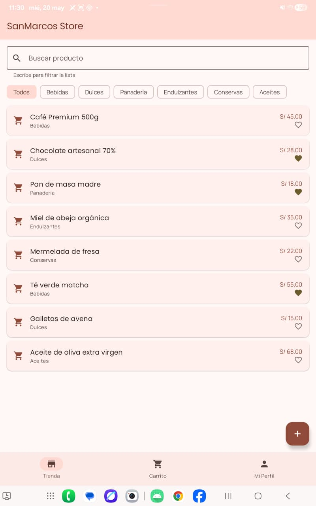
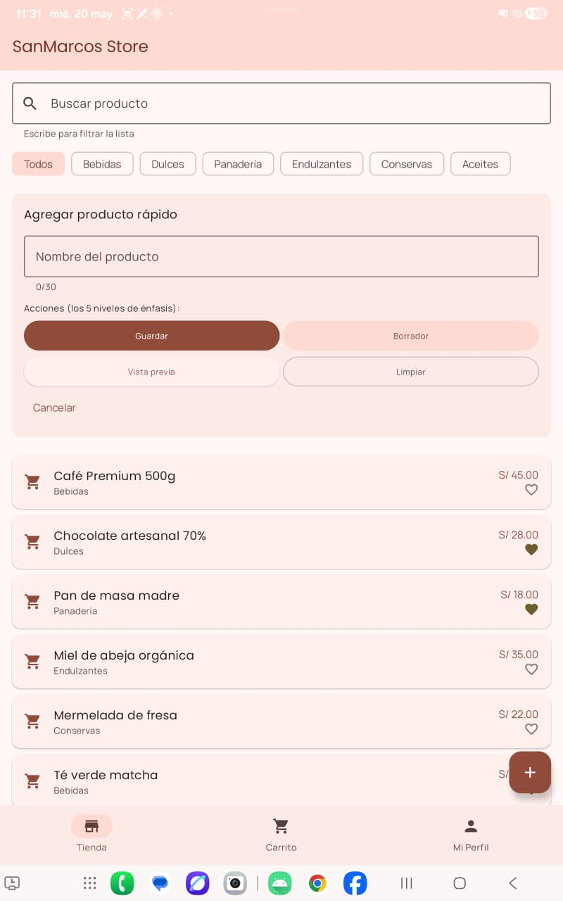
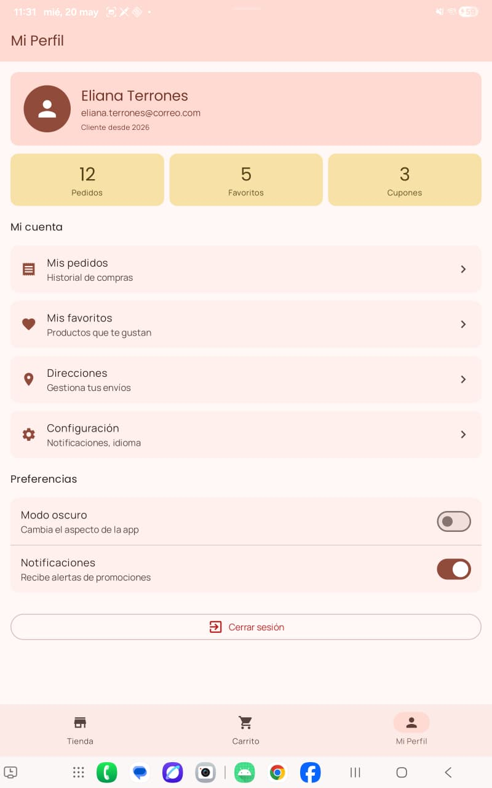

# 🛍️ Proyecto Tienda App

## 📌 Descripción
Aplicación móvil desarrollada en Android Studio con Jetpack Compose que simula una tienda de productos con navegación, favoritos, filtros, carrito y perfil de usuario.
---

## 📸 Capturas del sistema

### 🛒 Pantalla Tienda
Muestra la lista de productos con filtros por categoría y sistema de favoritos.

### 🧾 Tienda con formulario abierto
Se observa el formulario/acciones disponibles dentro de la pantalla tienda.

### 👤 Mi Perfil
Incluye datos personales, cambio de tema (claro/oscuro) y configuración de la app.

---

## 🧪 Ejercicios completados

### 🟢 Nivel 1 — Personalización
- Cambio de color principal (Material Theme Builder)
- Modificación de `Color.kt` con nuevo seed color
- Personalización de datos reales en `PerfilScreen`:
  - Nombre
  - Correo
  - Año académico
---

### 🟡 Nivel 2 — Funcionalidad
- Implementación de tab "Carrito" 🛒
  - Muestra mensaje: "Tu carrito está vacío"
- Sistema de favoritos ❤️ clickeable en productos
  - Cambio de estado dinámico
- Filtros por categoría usando `FilterChip`

📌 Resultado: Interacción dinámica con productos y organización por categorías.

### 🔴 Nivel 3 — Avanzado
- Navegación a pantalla de detalle de producto con ID en la ruta
- Implementación de modo oscuro global (Switch en perfil)
  - Uso de ViewModel o CompositionLocalProvider
- Persistencia de favoritos con DataStore
  - Los datos se mantienen al cerrar la app

📌 Resultado: App con arquitectura avanzada y persistencia de datos.

---

## 👨‍💻 Autor
Eliana Terrones Ulloa
